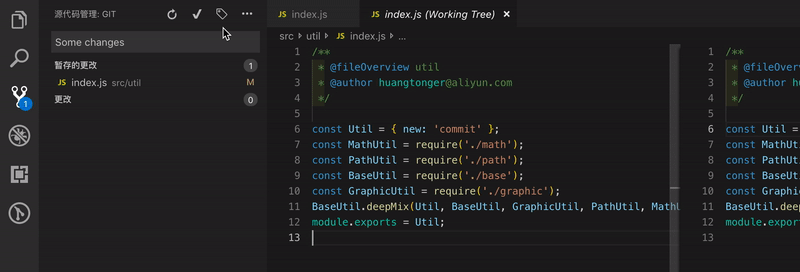
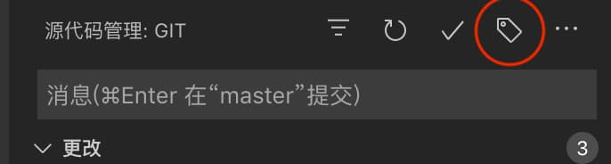
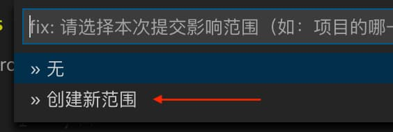
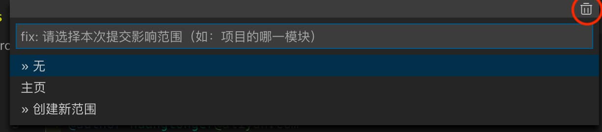

# Commit Tagger

仅需几次点击，轻松生成 Angular 风格的规范 commit message。

[GitHub](https://github.com/Mongkii/Commit-Tagger)

[Issue](https://github.com/Mongkii/Commit-Tagger/issues)

## 功能

- 轻轻一点，创建规范的 commit tag

- 记录和管理使用过的 scope

## 如何使用

- 有三种方式启动 Commit Tagger：

  - 在命令面板输入 `Commit Tagger`

  - 点击 Git 面板右上角的标签图标

  

  - 使用快捷键 （默认值：PC：Shift+Alt+C，Mac: Cmd+Ctrl+C）

- 选择 commit 类型，再选择影响的 scope

  - 没有 scope？点击“创建新范围”输入一个，所有使用过的 scope 会自动记录在列表里
    

  - 想要删除 scope？点击输入框右上角的齿轮，进入设置页面
    

_注：每个 workspace 的 scope 列表是各自独立的_

## 版本信息

### 2.0.0

NEW:

- 选择 commit 风格
- 使用函数，根据分支名自动生成提交信息
- Commit Tagger 设置页面
- 快捷键

FIX:

- 添加「影响范围」时没有去重

### 1.0.1

FIX: 有时选择完 scope 后，菜单不会自动关闭

### 1.0.0

首次发布

## TODO

- [ ] i18n
- [ ] 自定义 commit 风格
- [ ] 自定义 commit type（Git Emoji 支持）
- [ ] commit type / scope 自定义排序
