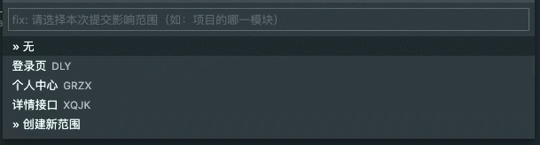

# Commit Tagger

仅需几次点击，轻松生成 Angular 风格的规范 commit message。

[GitHub](https://github.com/Mongkii/Commit-Tagger)

[Issue](https://github.com/Mongkii/Commit-Tagger/issues)

## 功能

- 轻轻一点，创建规范的 commit tag

- 记录和管理使用过的 scope

## 如何使用

1. 用以下三种方式启动 Commit Tagger：

   - 在命令面板输入 `Commit Tagger`

   - 点击 Git 面板右上角的标签图标

     

   - 使用快捷键 （默认值：PC：Shift+Alt+C，Mac: Cmd+Ctrl+C）

2. 选择 commit 类型，再选择影响的 scope

   - scope 可通过音序快速定位

     

   - 没有 scope？点击“创建新范围”输入一个，所有使用过的 scope 会自动记录在列表里

     

   - 想要删除 scope？点击输入框右上角的齿轮，进入设置页面

     

_注：每个 workspace 的 scope 列表是各自独立的_

## 近期更新

### 2.1.4

FEAT:

- 进入设置页时关闭命令面板

FIX:

- 图标过大导致在 Git 面板无法正常显示（[#4](https://github.com/Mongkii/Commit-Tagger/issues/4)）

### 2.1.2

FIX:

- 无 scope 时，在设置页无法新建 scope
- QuickPick 组件由于未设置 title，导致展示为占位符「;」
- 设置页样式未正确加载

### 2.1.0

FEAT:

- 选择 scope 时，可以使用拼音音序快速定位

**查看以往更新，请前往 [CHANGELOG](https://github.com/Mongkii/Commit-Tagger/blob/master/CHANGELOG.md)**

## TODO

- [ ] i18n
- [ ] 自定义 commit 风格
- [ ] 自定义 commit type（Git Emoji 支持）
- [ ] commit type / scope 自定义排序
